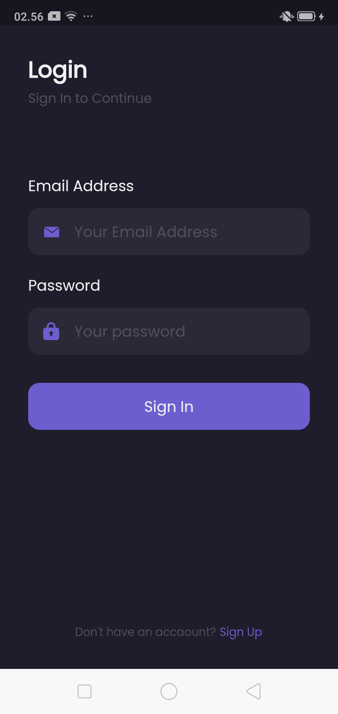
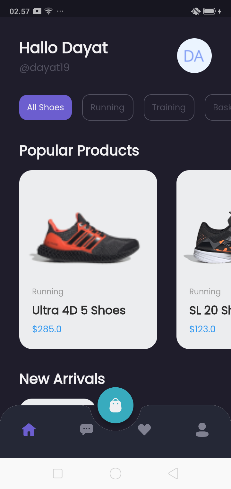
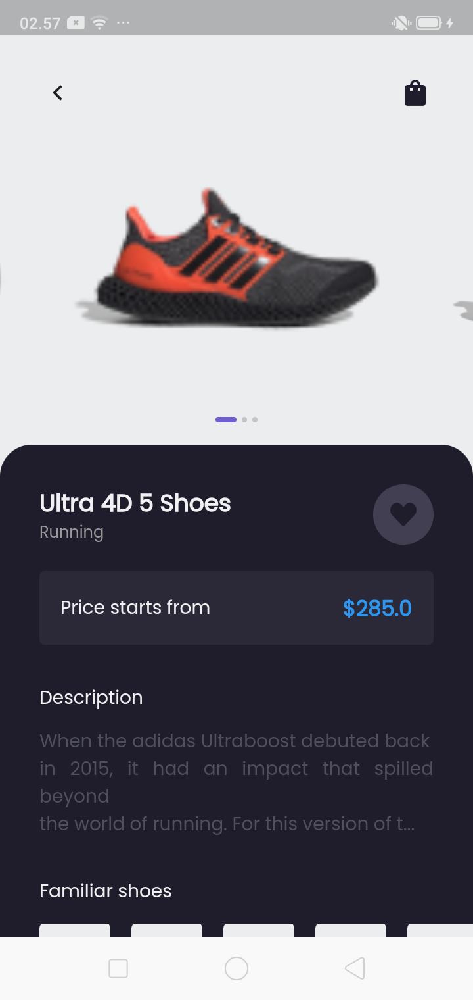
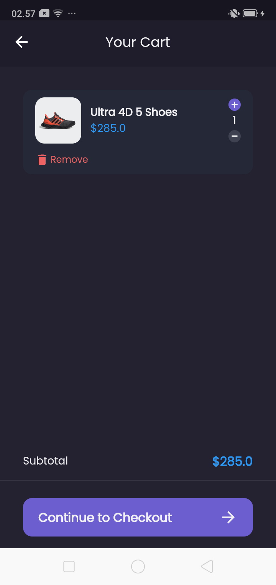
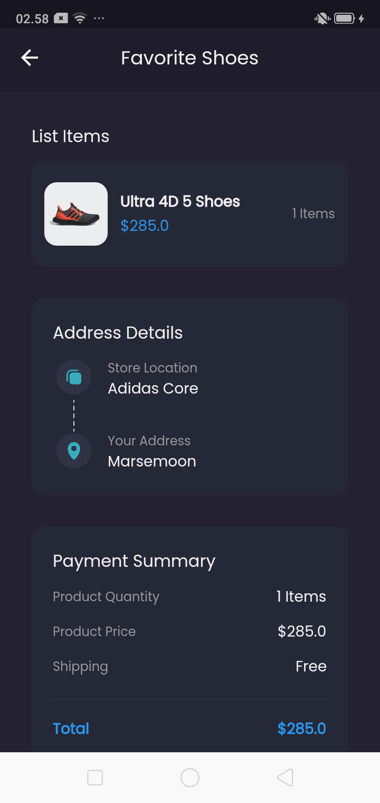
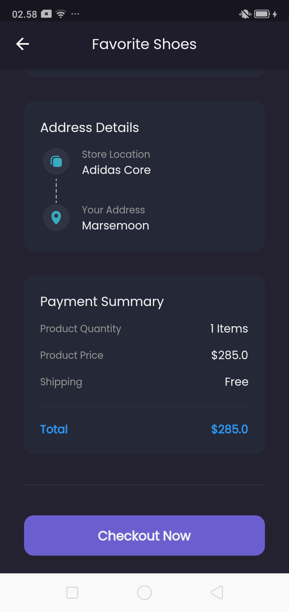
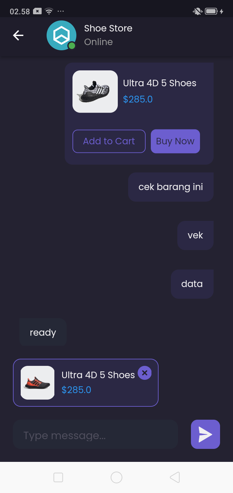

# Flutter E-Commerce

Shamo adalah aplikasi e-commerce yang dibuat menggunakan teknologi Flutter dan GetX, sebuah library state management untuk Flutter yang memungkinkan pengembangan aplikasi dengan performa tinggi dan skalabilitas yang baik.

Dalam pengembangan aplikasi e-commerce seperti Shamo, penggunaan Flutter dan GetX dapat mempercepat pengembangan dan memudahkan pengelolaan state dan data pada aplikasi. Keduanya juga memungkinkan pembuatan aplikasi yang lebih responsif dan mudah digunakan oleh pengguna.

Berikut ini adalah beberapa teknologi yang digunakan untuk pengembangan aplikasi e-commerce.

- Flutter
- Dart
- Api
- Firebase 
- State Management GetX

## Pre Realeases Apk
Untuk menggunakan aplikasi, anda bisa mendownload .apk di link bawah ini
<a href="https://github.com/hidayatullah191001/flutter-ecommerce/releases/tag/v1.0.0" target="_blank">Download APK</a>

## Screenshots
Ini adalah beberapa hasil screenshots aplikasi Shamo, Aplikasi E-Commerce yang dibuat menggunakan Flutter dan GetX
### SplashScreen

### Login Page

### Register Page

### Home Page

### Detail Produk Page

### Cart Page

### Checkout Page

### Chat Page

